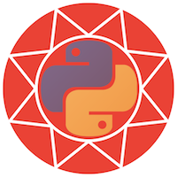

<a name="logo"/>
<div align="center">
</img>
</div>

# PyCall: Calling Python functions from the Ruby language

[](https://github.com/mrkn/pycall.rb/actions?query=workflow%3ACI)
[](https://ci.appveyor.com/project/mrkn/pycall-rb/branch/master)

This library provides the features to directly call and partially interoperate
with Python from the Ruby language.  You can import arbitrary Python modules
into Ruby modules, call Python functions with automatic type conversion from
Ruby to Python.

## Supported Ruby versions

pycall.rb supports Ruby version 2.4 or higher.

## Supported Python versions

pycall.rb supports Python version 2.7 or higher.

Note that in Python 2.7 old-style class, that is defined without a super class, is not fully supported in pycall.rb.

## Note for pyenv users

pycall.rb requires Python's shared library (e.g. `libpython3.7m.so`).
pyenv does not build the shared library in default, so you need to specify `--enable-shared` option at the installation like below:

```
$ env PYTHON_CONFIGURE_OPTS='--enable-shared' pyenv install 3.7.2
```

## Installation

Add this line to your application's Gemfile:

```ruby
gem 'pycall'
```

And then execute:

    $ bundle

Or install it yourself as:

    $ gem install --pre pycall

## Usage

Here is a simple example to call Python's `math.sin` function and compare it to
the `Math.sin` in Ruby:

    require 'pycall'
    math = PyCall.import_module("math")
    math.sin(math.pi / 4) - Math.sin(Math::PI / 4)   # => 0.0

Type conversions from Ruby to Python are automatically performed for numeric,
boolean, string, arrays, and hashes.

### Calling a constructor

In Python, we call the constructor of a class by `classname(x, y, z)` syntax.  Pycall.rb maps this syntax to `classname.new(x, y, z)`.

### Calling a callable object

In Python, we can call the callable object by `obj(x, y, z)` syntax.  PyCall.rb maps this syntax to `obj.(x, y, z)`.

### Passing keyword arguments

In Python, we can pass keyword arguments by `func(x=1, y=2, z=3)` syntax.  In pycallrb, we should rewrite `x=1` to `x: 1`.

### The callable attribute of an object

Pycall.rb maps the callable attribute of an object to the instance method of the corresponding wrapper object. So, we can write a Python expression `obj.meth(x, y, z=1)` as `obj.meth(x, y, z: 1)` in Ruby. This mapping allows us to call these attributes naturally as Ruby's manner.

But, unfortunately, this mapping prohibits us to get the callable attributes.  We need to write `PyCall.getattr(obj, :meth)` in Ruby to get `obj.meth` object while we can write `obj.meth` in Python.

### Specifying the Python version

If you want to use a specific version of Python instead of the default,
you can change the Python version by setting the `PYTHON` environment variable
to the path of the `python` executable.

When `PYTHON` is not specified, pycall.rb tries to use `python3` first,
and then tries to use `python`.

### Releasing the RubyVM GVL during Python function calls

You may want to release the RubyVM GVL when you call a Python function that takes very long runtime.
PyCall provides `PyCall.without_gvl` method for such purpose.  When PyCall performs python function call,
PyCall checks the current context, and then it releases the RubyVM GVL when the current context is in a `PyCall.without_gvl`'s block.

```ruby
PyCall.without_gvl do
  # In this block, all Python function calls are performed without
  # the GVL acquisition.
  pyobj.long_running_function()
end

# Outside of PyCall.without_gvl block,
# all Python function calls are performed with the GVL acquisition.
pyobj.long_running_function()
```

### Debugging python finder

When you encounter `PyCall::PythonNotFound` error, you can investigate PyCall's python finder by setting `PYCALL_DEBUG_FIND_LIBPYTHON` environment variable to `1`.  You can see the log like below:

```
$ PYCALL_DEBUG_FIND_LIBPYTHON=1 ruby -rpycall -ePyCall.builtins
DEBUG(find_libpython) find_libpython(nil)
DEBUG(find_libpython) investigate_python_config("python3")
DEBUG(find_libpython) libs: ["Python.framework/Versions/3.7/Python", "Python", "libpython3.7m", "libpython3.7", "libpython"]
DEBUG(find_libpython) libpaths: ["/opt/brew/opt/python/Frameworks/Python.framework/Versions/3.7/lib", "/opt/brew/opt/python/lib", "/opt/brew/opt/python/Frameworks", "/opt/brew/Cellar/python/3.7.2_1/Frameworks/Python.framework/Versions/3.7", "/opt/brew/Cellar/python/3.7.2_1/Frameworks/Python.framework/Versions/3.7/lib"]
DEBUG(find_libpython) Unable to find /opt/brew/opt/python/Frameworks/Python.framework/Versions/3.7/lib/Python.framework/Versions/3.7/Python
DEBUG(find_libpython) Unable to find /opt/brew/opt/python/Frameworks/Python.framework/Versions/3.7/lib/Python.framework/Versions/3.7/Python.dylib
DEBUG(find_libpython) Unable to find /opt/brew/opt/python/Frameworks/Python.framework/Versions/3.7/lib/darwin/Python.framework/Versions/3.7/Python
DEBUG(find_libpython) Unable to find /opt/brew/opt/python/Frameworks/Python.framework/Versions/3.7/lib/darwin/Python.framework/Versions/3.7/Python.dylib
DEBUG(find_libpython) Unable to find /opt/brew/opt/python/lib/Python.framework/Versions/3.7/Python
DEBUG(find_libpython) Unable to find /opt/brew/opt/python/lib/Python.framework/Versions/3.7/Python.dylib
DEBUG(find_libpython) Unable to find /opt/brew/opt/python/lib/darwin/Python.framework/Versions/3.7/Python
DEBUG(find_libpython) Unable to find /opt/brew/opt/python/lib/darwin/Python.framework/Versions/3.7/Python.dylib
DEBUG(find_libpython) dlopen("/opt/brew/opt/python/Frameworks/Python.framework/Versions/3.7/Python") = #<Fiddle::Handle:0x00007fc012048650>
```

## Special notes for specific libraries

### matplotlib

Use [mrkn/matplotlib.rb](https://github.com/mrkn/matplotlib.rb) instead of just importing it by `PyCall.import_module("matplotlib")`.

### numpy

Use [mrkn/numpy.rb](https://github.com/mrkn/numpy.rb) instead of just importing it by `PyCall.import_module("numpy")`.

### pandas

Use [mrkn/pandas.rb](https://github.com/mrkn/pandas.rb) instead of just importing it by `PyCall.import_module("pandas")`.

## PyCall object system

PyCall wraps pointers of Python objects in `PyCall::PyPtr` objects.
`PyCall::PyPtr` class has two subclasses, `PyCall::PyTypePtr` and
`PyCall::PyRubyPtr`.  `PyCall::PyTypePtr` is specialized for type (and classobj
in 2.7) objects, and `PyCall::PyRubyPtr` is for the objects that wraps pointers
of Ruby objects.

These `PyCall::PyPtr` objects are used mainly in PyCall infrastructure.
Instead, we usually treats the instances of `Object`, `Class`, `Module`, or
other classes that are extended by `PyCall::PyObjectWrapper` module.

`PyCall::PyObjectWrapper` is a mix-in module for objects that wraps Python
objects.  A wrapper object should have `PyCall::PyPtr` object in its instance
variable `@__pyptr__`.  `PyCall::PyObjectWrapper` assumes the existance of
`@__pyptr__`, and provides general translation mechanisms between Ruby object
system and Python object system.  For example, `PyCall::PyObjectWrapper`
translates Ruby's coerce system into Python's swapped operation protocol.

## Deploying on Heroku

Heroku's default version of Python is not compiled with the `--enabled-shared`
option and can't be accessed by PyCall. Alternative [buildpacks](https://devcenter.heroku.com/articles/buildpacks) are available,
including these that have been reported to work with PyCall:

https://github.com/richgong/heroku-buildpack-python
https://github.com/dsounded/heroku-buildpack-python
https://github.com/ReforgeHQ/heroku-buildpack-python

These community-developed buildpacks are not supported by Heroku, so it's
worth examining the source to make sure the buildpack you use suits your
needs. For instance, 'ReforgeHQ' works well with Python 3.8.1, but has not
been configured to work with other versions and may not be as generally
useful as the 'dsounded' or 'richgong' buildpacks.

The buildpack will expect to find both a `runtime.txt` and a `requirements.txt` 
file in the root of your project. You will need to add these to specify the 
version of Python and any packages to be installed via `pip`, _e.g_ to use 
version Python 3.8.1 and version 2.5 of the 'networkx' package:

    $ echo "python-3.8.1" >> runtime.txt
    $ echo "networkx==2.5" >> requirements.txt

Commit these two files into project's repository. You'll use these to manage
your Python environment in much the same way you use the `Gemfile` to manage
Ruby.

Heroku normally detects which buildpacks to use, but you will want to override
this behavior. It's probably best to clear out existing buildpacks and specify
exactly which buildpacks from scratch.

First, take stock of your existing buildpacks:

    $ heroku buildpack [-a YOUR_APP_NAME]

For a Ruby/Rails application this will typically report the stock `heroku/ruby`
buildpack, or possibly both `heroku/ruby` and `heroku/nodejs`. 

Clear the list and progressively add back your buildpacks, starting with the Python 
community-developed buildpack. For example, if `ruby` and `nodejs` buildpacks were 
previously installed, and chosing the 'ReforgeHQ' buildback, your setup process will 
be similar to this: 

    $ heroku buildpacks:clear
    $ heroku buildpacks:add https://github.com/ReforgeHQ/heroku-buildpack-python -i 1
    $ heroku buildpacks:add heroku/nodejs -i 2
    # heroku buildpacks:add heroku/ruby -i 3

If you have multiple applications on Heroku you will need to append each of these 
with application's identifier (_e.g._ `heroku buildpacks:clear -a YOUR_APP_NAME`).

With each buildpack we are registering its index (the `-i` switch) in order to 
specify the order Heroku will load runtimes and execute bootstrapping code. It's 
important for the Python environment to be engaged first, as PyCall will need to 
be able to find it when Ruby-based processes start. 

Once you have set up your buildpacks, and have commited both `requirements.txt` and 
`runtime.txt` files to git, deploy your Heroku application as your normally would.
The Python bootstrapping process will appear in the log first, followed by the Ruby
and so on. PyCall should now be able to successfully call Python functions from 
within the Heroku environment.

NB It is also possible to specify buildpacks within Docker images on Heroku.
See Heroku's [documentation on using Docker Images](https://devcenter.heroku.com/articles/build-docker-images-heroku-yml).

## Development

After checking out the repo, run `bin/setup` to install dependencies.
Then, run `rake spec` to run the tests. You can also run `bin/console`
for an interactive prompt that will allow you to experiment.

To install this gem onto your local machine, run `bundle exec rake install`.
To release a new version, update the version number in `version.rb`,
and then run `bundle exec rake release`, which will create a git tag for the
version, push git commits and tags, and push the `.gem` file to
[rubygems.org](https://rubygems.org).

## Contributing

Bug reports and pull requests are welcome on GitHub at
https://github.com/mrkn/pycall.rb.


## Acknowledgement

[PyCall.jl](https://github.com/JuliaPy/PyCall.jl) is referred too many times
to implement this library.

## License

The gem is available as open source under the terms of the
[MIT License](http://opensource.org/licenses/MIT).
